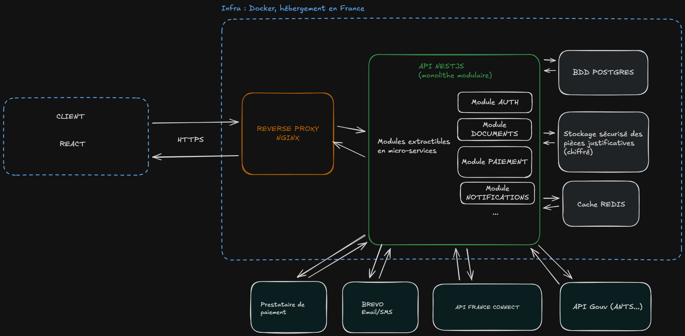
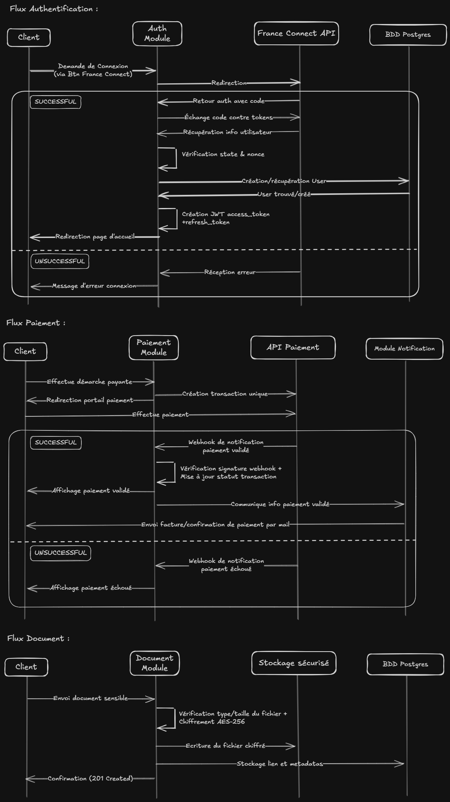
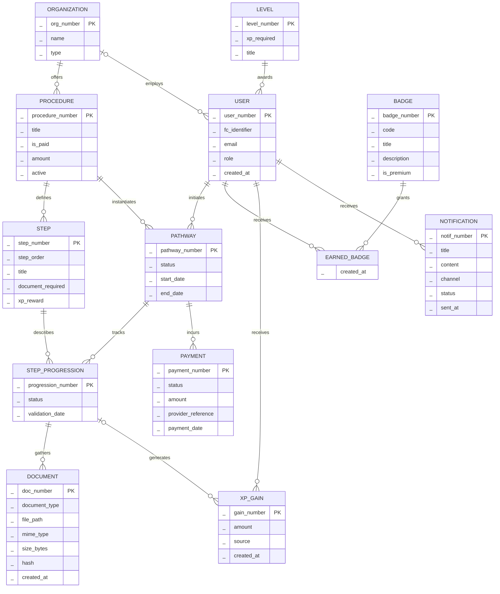
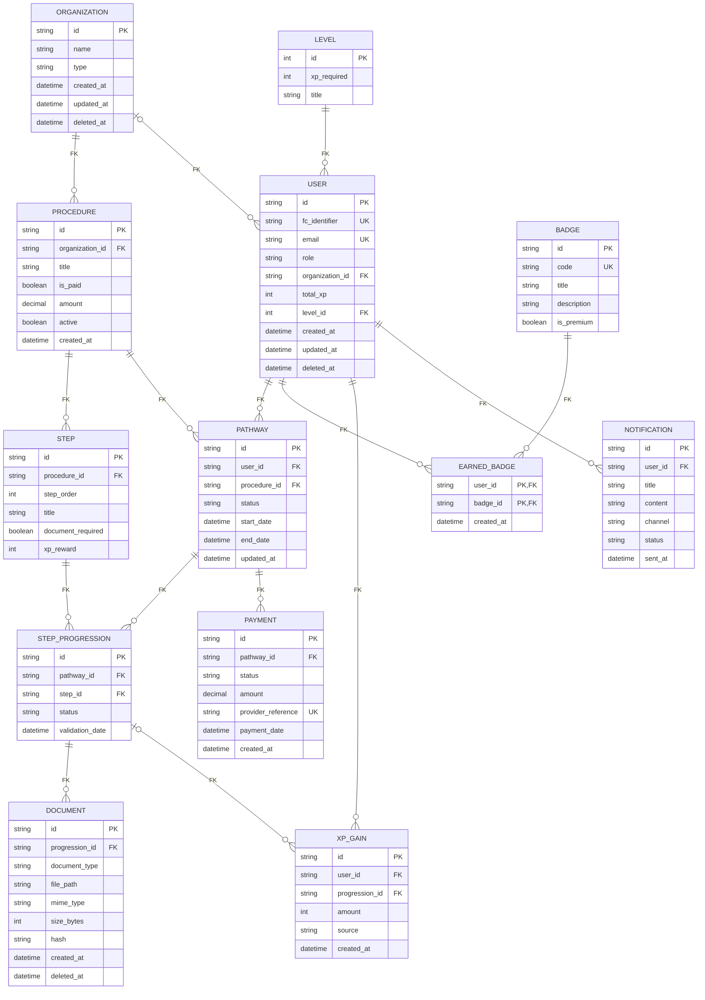

# Conception technique

## 1. Architecture système

### 1.1 Schéma global



### 1.2 Modules fonctionnels

- **Module Auth (Authentification et autorisation)**
	- **Responsabilité :** Gestion des sessions utilisateurs et sécurité des accès.
	- **Fonctionnalités :** Intégration FranceConnect, gestion des jetons JWT, contrôle des accès (rôles/permissions).
	- **Interaction :** Point d'entrée pour toute requête sécurisée : valide l'identité avant de transmettre la requête aux autres modules.
- **Module Quêtes (Parcours administratifs)**
	- **Responsabilité :** Transformer une démarche administrative en parcours guidé, étape par étape.
	- **Fonctionnalités :** Catalogue des démarches et de leurs étapes, création d'un parcours pour un citoyen, validation des étapes, calcul de la progression.
	- **Interaction :** S'appuie sur Documents pour les étapes qui demandent une pièce justificative et sur Paiement pour les démarches payantes. Prévient Gamification et Notifications à chaque étape validée, via les événements internes de NestJS.
- **Module Gamification (Récompenses)**
	- **Responsabilité :** Récompenser l'avancement du citoyen.
	- **Fonctionnalités :** Attribution des XP, calcul du niveau, déblocage des badges.
	- **Interaction :** Réagit aux événements du module Quêtes (étape validée, parcours terminé), sans jamais modifier les données des démarches.
- **Module Documents (Stockage sécurisé)**
	- **Responsabilité :** Gestion du cycle de vie des pièces justificatives.
	- **Fonctionnalités :** Téléversement, vérification (type, taille), chiffrement (AES-256), stockage et contrôle d'intégrité des pièces justificatives.
	- **Interaction :** Utilisé par le module Quêtes. Délègue le stockage physique au service de fichiers sécurisé.
- **Module Paiement (Transactions sécurisées)**
	- **Responsabilité :** Gestion des démarches payantes (ex : timbres fiscaux, frais de dossier).
	- **Fonctionnalités :** Intégration avec un prestataire de paiement certifié, génération de reçus, suivi des statuts de transaction (en attente, payé, échoué).
	- **Interaction :** Ne voit jamais les données bancaires : la saisie se fait chez le prestataire, qui confirme le paiement par webhook.
- **Module Notifications (Communication)**
	- **Responsabilité :** Gestion des alertes et des relances.
	- **Fonctionnalités :** Envoi d'emails et de SMS.
	- **Interaction :** Abstraction du service tiers (Brevo). Reçoit les demandes des autres modules pour notifier l'utilisateur.

### 1.3 Flux de données critiques



### 1.4 Patterns retenus

Pour le MVP, je reste sur des bases solides et éprouvées :

- **Monolithe modulaire :** au lieu de diviser tout de suite en microservices (qui ajoutent beaucoup de complexité réseau), je structure l'API NestJS en **modules indépendants**. Chaque module a son propre dossier, ses propres services et contrôleurs.
- **Architecture en couches :** le classique qui fonctionne :
	- Présentation (Controllers NestJS côté API, React côté client)
	- Logique métier (Services)
	- Accès aux données (Prisma / PostgreSQL)

**Pourquoi ce choix ?** Cela permet de développer vite. Si le projet décolle et qu'un module devient trop lourd, on pourra l'extraire en microservice plus tard, car le code est déjà découpé logiquement.

### 1.5 Stack technique

L'architecture repose sur un **monolithe modulaire** NestJS : la logique métier est centralisée pour le MVP, mais chaque domaine (Auth, Quêtes, Gamification, Documents, Paiement, Notifications) est isolé dans son propre module. Ce découpage simplifie la maintenance et prépare une transition vers des microservices (avec Kubernetes) si la phase 2 du cahier des charges (mois 7 à 12) l'exige.

| Composant | Technologie | Justification |
| --- | --- | --- |
| **Frontend** | **React (TypeScript)** | Interface responsive (mobile et desktop) sans app native à maintenir, écosystème riche en composants accessibles (RGAA). |
| **Framework backend** | **NestJS (TypeScript)** | Architecture modulaire native, adaptée au monolithe modulaire. Le typage fort réduit les erreurs sur des données sensibles. |
| **API** | **REST** | Standard universel, intégration simple avec les services publics (FranceConnect, API Gouv). |
| **Authentification** | **FranceConnect (OpenID Connect) + JWT** | Identification officielle imposée par le cahier des charges. JWT court + refresh token pour sécuriser les sessions. |
| **Base de données** | **PostgreSQL** | Fiabilité relationnelle (ACID), adaptée aux données administratives qui demandent une forte intégrité. |
| **ORM** | **Prisma** | Types TypeScript générés depuis le schéma, migrations versionnées dans le repo, requêtes paramétrées contre les injections SQL. S'intègre bien à NestJS. Gère nativement les UUID, ENUM et contraintes d'unicité composées. |
| **Stockage documents** | **Stockage objet compatible S3, hébergé en France** | Sépare les fichiers (stockage) des métadonnées (BDD) : meilleure performance et chiffrement dédié (AES-256). |
| **Cache / sessions** | **Redis** | Accélère les requêtes fréquentes et stocke les refresh tokens de manière volatile. |
| **Emails / SMS** | **Brevo** | Prestataire français, conforme RGPD, cohérent avec la contrainte de souveraineté. |
| **Paiement** | **Prestataire certifié** | Aucune donnée bancaire ne transite par nos serveurs : la saisie se fait chez le prestataire. |
| **Reverse proxy** | **Nginx** | Point d'entrée unique : terminaison HTTPS, routage du trafic, limitation de débit. |
| **Conteneurisation** | **Docker** | Environnement identique du développement à la production, déploiement simplifié. |
| **Hébergement** | **Hébergeur français (ex. OVHcloud)** | Données sensibles hébergées en France, conformité RGPD et souveraineté. |

## 2. Modèle de données

### 2.1 MCD



EARNED_BADGE est une association porteuse de données entre USER et BADGE (la date d'obtention). Mermaid ne permet pas de la dessiner comme une association Merise, elle est donc représentée comme une entité.

### 2.2 MLD



### 2.3 Choix de modélisation

**Séparer le modèle et l'instance.** PROCEDURE et STEP décrivent une démarche, identique pour tout le monde. PATHWAY et STEP_PROGRESSION représentent le parcours d'un citoyen sur cette démarche. Le lien entre PROCEDURE et PATHWAY est le pivot du modèle : une même démarche sert de base à tous les parcours.

**Une gamification à part.** BADGE, EARNED_BADGE, LEVEL et XP_GAIN ne modifient jamais les tables des démarches. Le seul lien est optionnel : XP_GAIN peut pointer vers l'étape qui a rapporté les points, pour la traçabilité. On peut donc faire évoluer le système de jeu sans risque pour le traitement des dossiers.

**Le minimum de données personnelles.** Je ne stocke ni nom ni prénom : l'identité vient de FranceConnect via `fc_identifier`. Les pièces justificatives ne sont pas en base, seulement leur chemin, leur type et leur empreinte (hash), qui permet de vérifier qu'un fichier n'a pas été modifié. Les fichiers eux-mêmes sont chiffrés dans le stockage dédié.

**Des rôles simples.** Les rôles sont fixes pour le MVP (citoyen, agent, admin), donc un champ `role` suffit et les permissions sont appliquées dans le code. Un agent est rattaché à son administration via `organization_id` : il n'accède qu'aux démarches de son périmètre. Si les administrations ont besoin de rôles personnalisés, on ajoutera des tables Role et Permission.

**Deux redondances assumées :**
- **Le montant** est présent dans PROCEDURE (tarif actuel) et dans PAYMENT (tarif au moment du paiement). Si le tarif change, l'historique des paiements reste juste.
- **`total_xp` et `level_id` dans USER** évitent de recalculer la somme des XP à chaque affichage du tableau de bord. Ces données calculées n'apparaissent pas dans le MCD, elles sont ajoutées au niveau logique. Elles sont mises à jour en même temps que l'ajout d'une ligne dans XP_GAIN, qui reste la référence en cas de doute.

### 2.4 Passage au modèle physique (PostgreSQL)

Le passage au modèle physique sous PostgreSQL s'appuie sur les choix suivants :

- **UUID plutôt qu'auto-incrément** pour les identifiants : un identifiant non devinable empêche de parcourir les dossiers des autres en changeant un numéro dans l'URL. Ça ne remplace pas la vérification des droits côté API, c'est une protection en plus. Le type `uuid` natif est aussi plus léger qu'une chaîne de caractères.
- **ENUM pour les statuts, rôles, canaux et sources** : la base refuse toute valeur non prévue, et les valeurs possibles sont explicites.
- **DECIMAL(10,2) pour les montants** : contrairement aux nombres à virgule flottante, pas d'erreur d'arrondi sur les paiements.
- **TEXT pour le contenu des notifications**, dont la longueur est variable.
- **Suppression logique (`deleted_at`)** sur USER, ORGANIZATION et DOCUMENT : une suppression marque la ligne sans l'effacer, ce qui garde un historique en cas de contestation. Pour respecter le droit à l'oubli du RGPD, une tâche planifiée anonymise ou supprime définitivement les données une fois la durée de conservation légale dépassée.

### 2.5 Index et optimisations

Le cahier des charges demande des réponses API en moins de 200 ms. Les index prévus :

- **Unicité** : `fc_identifier`, `email`, `BADGE.code`, `provider_reference` (si le webhook de paiement arrive deux fois, la transaction n'est enregistrée qu'une fois), `(pathway_id, step_id)` dans STEP_PROGRESSION (une seule progression par étape), `(procedure_id, step_order)` dans STEP (pas deux étapes au même rang).
- **Clés étrangères** : toutes indexées. PostgreSQL ne le fait pas automatiquement, et ce sont elles qui servent dans les jointures.
- **Index composites pour les écrans les plus utilisés** :
	- `PATHWAY(user_id, status)` : le tableau de bord du citoyen, avec ses démarches en cours.
	- `PATHWAY(procedure_id, status)` : l'espace agent, qui filtre les dossiers par démarche et par statut.

## Annexe : extrait du schéma Prisma

Passage du MLD au code pour trois tables centrales : USER, PATHWAY et STEP_PROGRESSION.

```prisma
enum Role {
  CITIZEN
  AGENT
  ADMIN
}

enum PathwayStatus {
  IN_PROGRESS
  COMPLETED
  ABANDONED
}

enum ProgressionStatus {
  PENDING
  IN_PROGRESS
  VALIDATED
}

model User {
  id              String    @id @default(uuid()) @db.Uuid
  fc_identifier   String    @unique
  email           String    @unique
  role            Role      @default(CITIZEN)
  organization_id String?   @db.Uuid
  total_xp        Int       @default(0)
  level_id        Int       @default(1)
  created_at      DateTime  @default(now())
  updated_at      DateTime  @updatedAt
  deleted_at      DateTime?

  organization Organization? @relation(fields: [organization_id], references: [id])
  level        Level         @relation(fields: [level_id], references: [id])
  pathways     Pathway[]
  // ... autres relations (xp_gains, earned_badges, notifications)

  @@index([organization_id])
  @@index([level_id])
  @@map("users")
}

model Pathway {
  id           String        @id @default(uuid()) @db.Uuid
  user_id      String        @db.Uuid
  procedure_id String        @db.Uuid
  status       PathwayStatus @default(IN_PROGRESS)
  start_date   DateTime      @default(now())
  end_date     DateTime?
  updated_at   DateTime      @updatedAt

  user         User              @relation(fields: [user_id], references: [id])
  procedure    Procedure         @relation(fields: [procedure_id], references: [id])
  progressions StepProgression[]
  // ... autres relations (payments)

  @@index([user_id, status])
  @@index([procedure_id, status])
  @@map("pathways")
}

model StepProgression {
  id              String            @id @default(uuid()) @db.Uuid
  pathway_id      String            @db.Uuid
  step_id         String            @db.Uuid
  status          ProgressionStatus @default(PENDING)
  validation_date DateTime?

  pathway Pathway @relation(fields: [pathway_id], references: [id])
  step    Step    @relation(fields: [step_id], references: [id])
  // ... autres relations (documents, xp_gains)

  @@unique([pathway_id, step_id])
  @@index([step_id])
  @@map("step_progressions")
}
```

**Points à noter :**
- **`@@map("users")`** : `user` est un mot réservé en PostgreSQL, la table est donc nommée au pluriel.
- **Valeurs par défaut** : un nouvel utilisateur est citoyen, niveau 1, avec 0 XP. Un parcours démarre "en cours", une étape "en attente".