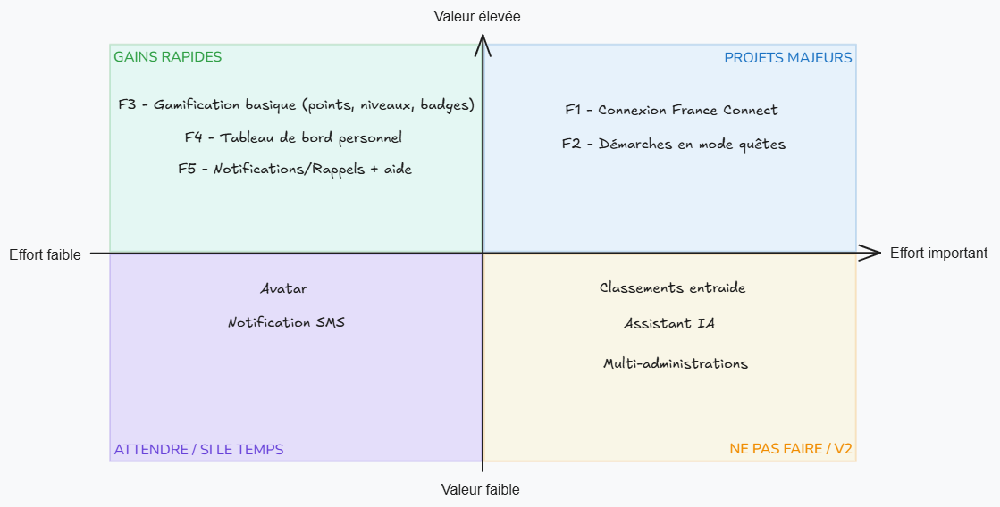
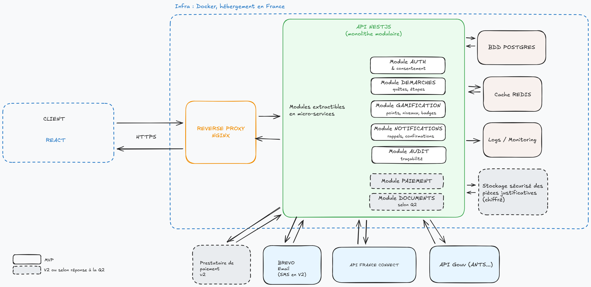

# Conception Notes de cadrage

## 1. Executive summary

- **Vision produit**

Ma vision du produit : Une couche "jeu", ludique, posée par-dessus les démarches administratives existantes, accessible via FranceConnect, qui aide le citoyen à savoir où il en est, quoi faire ensuite et à aller jusqu'au bout. La plateforme ne remplace pas les services administratifs : elle les rend lisibles, accessibles et motivants.

- **3 objectifs business** principaux identifiés

| Objectifs business                                                                     | Mesures                                                         |
| -------------------------------------------------------------------------------------- | --------------------------------------------------------------- |
| Réduire l'abandon sur des démarches ciblées                                            | Taux complétion vs données actuelles de l'administration pilote |
| Valider le concept avec une administration pilote pour lancer le déploiement (phase 2) | Résultats chiffrés et retours utilisateurs                      |
| Réduire la charge des agents                                                           | Baisse des dossiers incomplets /appels au support               |

- **Proposition de valeur** reformulée

*"Vos démarches par le jeu, simple et sans vous perdre"* : la plupart des citoyens/personas veulent de la clarté et gagner du temps. Moins de dossiers incomplets, moins d'appels pour l'administration.

## 2. Top 10 questions critiques 

| N°  | Question                                                                                                  | Impact       | Pourquoi critique ?                                                                                                                                     |     |
| --- | --------------------------------------------------------------------------------------------------------- | ------------ | ------------------------------------------------------------------------------------------------------------------------------------------------------- | --- |
| 1   | Quelles sont les démarches visées par le pilote ?                                                         | Bloquant     | "Toutes les démarches" n'est pas faisable en 6 mois                                                                                                     |     |
| 2   | La plateforme permet-elle de réaliser la démarche, ou redirige-t-elle vers les plateformes existantes ?   | Bloquant     | Change tout le périmètre : intégrations, dépôt de documents, paiement.                                                                                  |     |
| 3   | Comment définir le succès du pilote ? Y a-t-il des données existantes pour comparer les taux d'abandons ? | Bloquant     | Sans données de base, pas de comparatif possible                                                                                                        |     |
| 4   | L'habilitation FranceConnect est-elle obtenue ?                                                           | Bloquant     | Intégration prévue en phase 1 mais habilitation prend du temps                                                                                          |     |
| 5   | Quel est le budget réel/personnel prévu par phase ?                                                       | Bloquant     | Le cahier des charges précise "5 à 15 personnes" et "budget alloué selon les phases". Cela peut conditionner tout le MVP.                               |     |
| 6   | Les fonctions sociales (classements, entraide) sont-elles dans le MVP ? Qui modère ?                      | Important    | Risque de fuites de données / coût modération à prendre en compte. Le mode aidant pose aussi la question de l'accès d'un tiers aux données d'un usager. |     |
| 7   | Les 100k utilisateurs simultanés sont-ils visés dès le pilote ?                                           | Important    | Si on dimensionne pour 100 000 connexions dès le pilote, on paie une infrastructure inutile                                                             |     |
| 8   | Disponibilité d'un environnement de test (Sandbox) pour les API Gouv ?                                    | Important    | Essentiel pour ne pas casser la production lors des tests.                                                                                              |     |
| 9   | Qui met à jour le contenu des démarches quand la réglementation change ?                                  | Important    | Sans responsable désigné, les quêtes deviennent obsolètes à la première réforme. Ça décide aussi s'il faut un espace d'administration dès le MVP.       |     |
| 10  | Récompenses purement symboliques ou "réelles" (avantages, bons plans, réductions)?                        | Nice-to-have | Risques éthiques et coût                                                                                                                                |     |

## 3. Analyse MVP

- **5 fonctionnalités core** pour un MVP

| N°  | Fonctionnalité                                 | Contenu                                                                                                                    | Personas comblés           |
| --- | ---------------------------------------------- | -------------------------------------------------------------------------------------------------------------------------- | -------------------------- |
| 1   | Connexion FranceConnect                        | Compte minimal, consentement explicite, suppression de compte                                                              | Tous                       |
| 2   | Démarches en mode quêtes                       | 1 ou 2 démarches pilotes pour valider le processus, découpées en étapes, progression visuelle, retour arrière, sauvegarde  | Marie, Jean-Pierre         |
| 3   | Gamification basique (points, niveaux, badges) | Points par étapes, niveaux simples, quelques badges. Gamification désactivable                                             | Amélie, Andriniaina, Marie |
| 4   | Tableau de bord personnel                      | Démarche en cours, prochaine étape, historique, récépissés                                                                 | Andriniaina, Jean-Pierre   |
| 5   | Notifications/Rappels + aide                   | Notifications configurables (email dans un premier temps), aide par étape (explications simples), lien vers support humain | Jean-Pierre, Fatima, Marie |

- **Matrice effort/valeur** simple

- **Timeline proposée** (3 sprints)

| Sprint | Objectif           | Livrables                                                                                                                        |
| ------ | ------------------ | -------------------------------------------------------------------------------------------------------------------------------- |
| S1     | Socle et connexion | Modèle de données, CI/CD, FranceConnect en environnement de test 1ère démarche en parcours statique Accessibilité intégrée |
| S2     | Parcours réel      | Branchement API (selon la réponse à la question 2), gamification points/niveaux/badges Tableau de bord                        |
| S3     | Pilote prêt        | Notifications, aide contextuelle, suppression RGPD Tests + audit RGAA                                                         |

Objectif : MVP livré en 9 semaines, puis le reste de la phase pilote sert aux tests utilisateurs et aux itérations.
Le contenu des sprints pourra être ajusté selon la taille réelle de l'équipe (question 5).

- **3 fonctionnalités à reporter** en V2
	- Assistant IA : En MVP, une aide contextuelle suffit
	- Classement et dimension sociale (entraide) : risques de confidentialité, besoin de modération. À tester une fois la base validée
	- Multi-administration : Inutile si une seule administration pilote. On prépare sans le construire pour l'instant : un identifiant d'administration (tenant_id) prévu dans le modèle de données dès le S1.
À noter : un mode accompagnement pour les aidants (persona Fatima) viendrait aussi en V2. Il pourrait s'appuyer sur Aidants Connect, le service de l'État qui encadre déjà le mandat entre un aidant professionnel et un usager.

## 4. Risques majeurs et mitigation

- **Rejet des utilisateurs** : "une énième plateforme de service public", gamification perçue comme infantilisante -> **Mitigation** : co-conception avec des citoyens dès le départ, gamification sobre et désactivable.
- **Non-conformité RGPD / RGAA** : données sensibles, public très varié (seniors, personnes en situation de handicap) -> **Mitigation** : AIPD réalisée avant le pilote (avec l'outil PIA de la CNIL), accessibilité intégrée dès le premier sprint et audit RGAA avant le lancement.
- **Dépendance aux administrations** : habilitation FranceConnect longue à obtenir, API gouvernementales lentes, mal documentées ou instables -> **Mitigation** : démarche d'habilitation lancée dès le cadrage, environnement de test en attendant, appels aux API en asynchrone avec relance automatique, mode dégradé si une API est indisponible.

## 5. Approche recommandée

- **Méthodologie suggérée** (Agile/Lean)

Lean pour la question de fond (est-ce que la gamification réduit vraiment l'abandon ?) + Scrum en sprints de 3 semaines, avec une démo à l'administration pilote à chaque fin de sprint.

- **Équipe minimale** requise

| Équipe                                                             | Rôle                                          |
| ------------------------------------------------------------------ | --------------------------------------------- |
| 1 Product Owner                                                    | Lien avec administration pilote, priorisation |
| 3 développeurs fullstack                                           | Front React, Back NestJS/TS                   |
| 1 UX/UI                                                            | Parcours, accessibilité                       |
| 1 DevOps (mi-temps) ou un des développeurs avec compétences DevOps | CI/CD, hébergement, monitoring                |
| Ponctuellement : Juriste, référent administration                  | validations métier + RGPD                     |

- **3 quick wins** identifiés
	- Prototype interactif testé avec 5 citoyens (dont un sénior) : permet de valider l'intérêt de la gamification/plateforme
	- Réécrire la/les démarches pilotes en langage clair : permet de valider la base du contenu des quêtes
	- Connexion FranceConnect en environnement de test : prouvera que l'intégration fonctionne en attendant l'habilitation.

- **Prochaines étapes** concrètes
	- Cadrage avec l'administration pour répondre aux questions bloquantes
	- Choix de la démarche pilote
	- Mesure du taux d'abandon actuel
	- Lancement des habilitations FranceConnect + AIPD
	- Maquettes testées (avec intégration du référentiel RGAA) et démarrage sprint 1	  

## 6. Bonus

- Croquis ou schéma de l'**architecture high-level**

Monolithe modulaire pour le pilote plutôt que des microservices. Les modules sont bien séparés et pourront être extraits plus tard si la charge le justifie. Moins de complexité à opérer, plus de temps pour le produit.